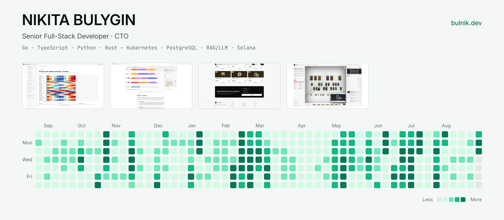

<a href="https://bulnik.dev">
  <picture>
    <source media="(prefers-color-scheme: dark)" srcset="assets/cover-dark.png">
    
  </picture>
</a>

# Nikita Bulygin

**Senior Full-Stack Developer · CTO** — bridging scalable development, operations (SRE),
and Machine Learning.

5+ years building production systems across full-stack, SRE and ML — from corporate
platforms and DevOps infrastructure to AI decision-support and Web3. Open to Developer,
Lead, and CTO roles.

## Selected work

| Project | Outcome | Stack |
| --- | --- | --- |
| **[Medical ERP/LIMS with Predictive AI](https://bulnik.dev/en/portfolio/med-platform)** Platforms · 2025 — 2026 | In production at medical facilities; explainable, reviewable, auditable AI | Python · TypeScript · Predictive ML · RAG · Qdrant · Kubernetes |
| **[TV Advertising Platform Optimization](https://bulnik.dev/en/portfolio/tv-adtech)** Platforms · 2024 — 2026 | ~20% faster processing, up to 30% lower operating expenses, 10+ production releases in six months | Go · TypeScript · PostgreSQL · Kubernetes · CI/CD |
| **[Constraint-Solver Platform for Media Scheduling](https://bulnik.dev/en/portfolio/slot-solver)** Platforms · 2026 | Three solvers behind one contract — scheduling decisions backed by measurement, not intuition | TypeScript · Python · OR-Tools · SharedArrayBuffer · SSE |
| **[AI Agent & Editorial Automation Pipeline](https://bulnik.dev/en/portfolio/ai-editorial)** AI · 2025 | Automation where it saves time; human control where quality matters | Python · TypeScript · LangChain · RAG · OpenAI API |
| **[Multi-Role Marketplace MVP in 8 Weeks](https://bulnik.dev/en/portfolio/marketplace-mvp)** MVP · 2024 | Three connected applications, one backend, five core functions, eight weeks | Go · TypeScript · Next.js · PostgreSQL · GitLab CI/CD |
| **[Solana RWA Tokenization](https://bulnik.dev/en/portfolio/rwa-tokenization)** Web3 · 2026 | Asset shares on-chain, built on top of the real-estate analysis platform | Rust · Solana · Anchor · Smart Contracts |

Nineteen cases in full, including live interactive demos — **[bulnik.dev/en/portfolio](https://bulnik.dev/en/portfolio)**

## Stack

| Layer | |
| --- | --- |
| **Languages** | Go *(services, gRPC, concurrency)* · TypeScript *(Next.js, Nuxt, Node)* · Python *(ML, data pipelines, FastAPI)* · Rust *(smart contracts, systems)* |
| **Infrastructure · DevOps · SRE** | Kubernetes · Docker · GitLab CI/CD · Temporal · n8n · self-hosted · SRE practices |
| **AI & Machine Learning** | Predictive ML · DSS · Human-in-the-Loop · RAG · Model Context Protocol · LangChain · Qdrant |
| **Backend · APIs · Messaging** | Gin · Fastify · Elysia · FastAPI · gRPC · GraphQL Federation · NATS · RabbitMQ · SSE |
| **Data stores** | PostgreSQL · ClickHouse · Redis · Qdrant · Typesense · S3 |
| **Analytics** | STL/MSTL · SARIMA · ETS · rolling-origin backtest · P10/P50/P90 · OR-Tools CP-SAT · D3.js |
| **Web3** | Solana · Anchor · Rust smart contracts · RWA tokenization |

## Links

- 🌐 Website — https://bulnik.dev
- ✉️ Email — byluginnikita@gmail.com
- 🦊 GitLab — https://gitlab.com/byluginnikita
- 🔬 ORCID — https://orcid.org/0009-0009-5292-7055

The cover is generated by <a href="tools/build_cover.py"><code>tools/build_cover.py</code></a> and rebuilt monthly.
